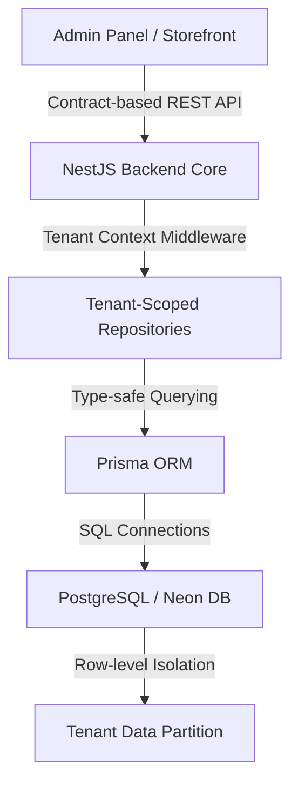
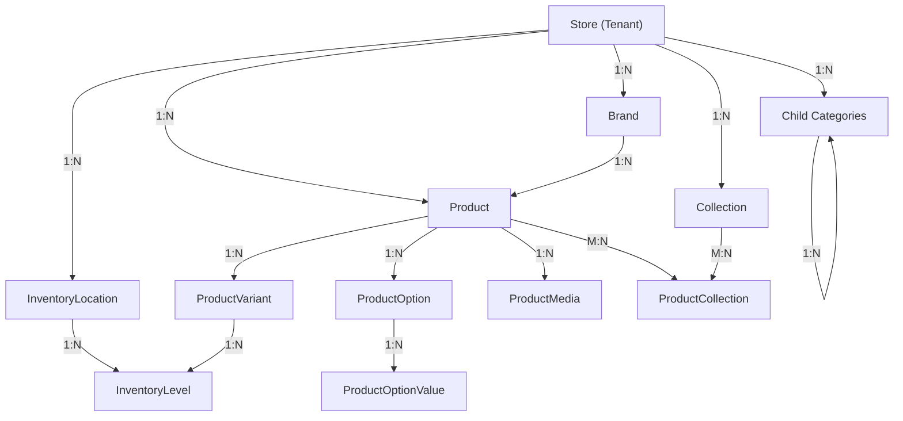
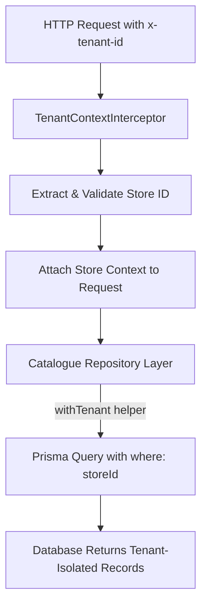

# Generic Ecommerce Platform — Phase 3A Implementation Progress
## Catalogue Backend & API Foundation

---

## 1. Project Context

The project is being developed as a generic, multi-tenant ecommerce platform designed to support scalable online retail operations. The architecture establishes a clear separation between frontend presentation layers and central business logic, governed by a unified backend API.

The planned end-to-end platform scope includes:

* **Customer Storefront** (Customer-facing shopping experience)
* **Admin Panel** (Merchant administration dashboard)
* **Unified Backend** (Central application core)
* **Catalogue Management** *(Phase 3A Focus)*
* **Inventory Management** *(Phase 3A Foundation)*
* **Orders & Checkout** *(Planned Scope)*
* **Payments Integration** *(Planned Scope)*
* **Customer Management** *(Planned Scope)*
* **Promotions & Discounts** *(Planned Scope)*
* **Loyalty Engine** *(Planned Scope)*
* **CMS & Content Engine** *(Planned Scope)*
* **Runtime Themes Engine** *(Planned Scope)*

> [!NOTE]
> Modules outside of Catalogue & Inventory Foundation are part of the planned platform roadmap and are not claimed as completed functionality in this phase.

---

## 2. Phase 3A Objective

Phase 3A focused on designing, implementing, and verifying the core **Catalogue Backend and API Foundation**. The objective of this milestone was to establish robust, tenant-isolated data models and RESTful APIs required for managing product data, categorization, and stock placement.

Key focus areas delivered in Phase 3A:

* **Product Management**: Support for base products, configurable options, and SKU variants.
* **Category Hierarchy**: Multi-level category structures for catalogue navigation.
* **Collections**: Dynamic and manual product groupings.
* **Brand Directory**: Brand metadata associated with tenant products.
* **Inventory Foundation**: Multi-location inventory placement and stock level tracking.
* **Multi-Tenant Data Isolation**: Strict tenant scoping across all database operations.
* **Role-Based Access Control (RBAC)**: Role and permission enforcement on admin endpoints.
* **API Input Validation**: Strict request payload and query validation using Zod schemas.
* **OpenAPI / Swagger Documentation**: Interactive API documentation generated at `/api/docs`.
* **Pagination, Filtering & Sorting**: Unified query parameter handling across list endpoints.
* **Automated Testing & Verification**: Unit and integration test suite passing verified build gates.

---

## 3. Architecture

The system follows a strict layered architecture. Frontend presentation applications (Storefront and Admin Panel) do not have direct access to the database layer. All data access occurs through contract-governed API requests processed by the NestJS application server.



### Architectural Guarantees

1. **Decoupled Frontend**: Frontends consume JSON APIs defined via Zod schemas and OpenAPI contracts.
2. **Context Resolution**: Incoming requests are resolved to a specific Tenant/Store ID before execution.
3. **Repository Scoping**: All Prisma database operations automatically include store scoping (`where: { storeId }`).
4. **Data Privacy**: No cross-tenant data leaks are possible during list, read, update, or delete operations.

---

## 4. Technology Used

The implementation strictly utilizes technologies configured and verified within the repository monorepo structure.

| Technology | Purpose / Layer | Implementation Status |
|---|---|---|
| **TypeScript** | Strict-mode type safety across all workspace packages | Implemented |
| **NestJS** | Modular backend framework and HTTP controllers | Implemented |
| **Prisma ORM** | Type-safe database mapping and query engine | Implemented |
| **PostgreSQL / Neon** | Relational database hosting tenant datasets | Implemented |
| **Zod** | Runtime request validation and schema definitions | Implemented |
| **OpenAPI / Swagger** | API specification and interactive docs (`/api/docs`) | Implemented |
| **React** | Component framework for Storefront and Admin apps | Implemented |
| **Next.js** | Framework for Storefront application | Implemented |
| **Vite** | Build tool and dev server for Admin SPA | Implemented |
| **Tailwind CSS** | Design system token styling across frontends | Implemented |
| **Turborepo** | Monorepo build orchestration and task caching | Implemented |
| **pnpm** | Workspace dependency management | Implemented |
| **Vitest** | Automated unit and integration test runner | Implemented |
| **Git / GitHub** | Source control and release workflow | Implemented |

---

## 5. Database / Data Model

The catalogue schema is designed to handle multi-tenant product catalogs with multi-option configurable items (e.g., Size, Color) and multi-location inventory levels.

### Key Models & Descriptions

* **`Store` / `Tenant`**: The root entity representing a merchant account or tenant boundary.
* **`Product`**: Represents the base product listing (title, description, slug, status, brand, category).
* **`ProductVariant`**: Specific purchasable SKU with its own price, SKU code, barcode, and option values.
* **`ProductOption`**: Configurable attribute axis attached to a product (e.g., "Size", "Color").
* **`ProductOptionValue`**: Specific value for an option (e.g., "Large", "Midnight Blue").
* **`Category`**: Hierarchical category node supporting parent-child relationships for navigation.
* **`Collection`**: Groupings of products created for promotional or curated views.
* **`ProductCollection`**: Join table managing many-to-many relationships between products and collections.
* **`Brand`**: Manufacturer or brand entity linked to products.
* **`InventoryLocation`**: Physical or virtual warehouse, store, or fulfillment center.
* **`InventoryLevel`**: Stock quantity matrix mapping a `ProductVariant` to an `InventoryLocation`.
* **`ProductMedia`**: Media asset associations (images, gallery items) linked to products.

### Data Model Entity Relationship Diagram



---

## 6. API Endpoints

The Phase 3A API delivers RESTful endpoints for managing catalogue resources. All endpoints require tenant context headers (`x-tenant-id`) and apply RBAC permissions for administrative routes.

### Product Endpoints

| HTTP Method | Endpoint | Purpose | Authorization |
|---|---|---|---|
| `GET` | `/products` | Retrieve paginated, tenant-scoped product catalog | Public / Customer |
| `GET` | `/products/:id` | Fetch single product with variants, options, and media | Public / Customer |
| `POST` | `/products` | Create a new base product with options and variants | `STORE_ADMIN`, `STORE_STAFF` |
| `PUT` | `/products/:id` | Update product details, options, or variant mappings | `STORE_ADMIN`, `STORE_STAFF` |
| `DELETE` | `/products/:id` | Archive or delete product record | `STORE_ADMIN` |

### Category Endpoints

| HTTP Method | Endpoint | Purpose | Authorization |
|---|---|---|---|
| `GET` | `/categories` | Retrieve hierarchical category tree for active tenant | Public / Customer |
| `GET` | `/categories/:id` | Fetch single category details and associated product count | Public / Customer |
| `POST` | `/categories` | Create a new category or subcategory | `STORE_ADMIN`, `STORE_STAFF` |
| `PUT` | `/categories/:id` | Update category details or parent assignment | `STORE_ADMIN`, `STORE_STAFF` |
| `DELETE` | `/categories/:id` | Delete category record | `STORE_ADMIN` |

### Collection Endpoints

| HTTP Method | Endpoint | Purpose | Authorization |
|---|---|---|---|
| `GET` | `/collections` | List active collections | Public / Customer |
| `GET` | `/collections/:id` | Retrieve collection details with linked products | Public / Customer |
| `POST` | `/collections` | Create dynamic or manual collection | `STORE_ADMIN`, `STORE_STAFF` |
| `PUT` | `/collections/:id` | Update collection details and product assignments | `STORE_ADMIN`, `STORE_STAFF` |
| `DELETE` | `/collections/:id` | Remove collection record | `STORE_ADMIN` |

### Brand Endpoints

| HTTP Method | Endpoint | Purpose | Authorization |
|---|---|---|---|
| `GET` | `/brands` | Retrieve list of brands for active tenant | Public / Customer |
| `POST` | `/brands` | Add new brand entry | `STORE_ADMIN`, `STORE_STAFF` |
| `PUT` | `/brands/:id` | Update brand metadata | `STORE_ADMIN`, `STORE_STAFF` |
| `DELETE` | `/brands/:id` | Remove brand entry | `STORE_ADMIN` |

### Inventory Endpoints

| HTTP Method | Endpoint | Purpose | Authorization |
|---|---|---|---|
| `GET` | `/inventory/locations` | List fulfillment locations for tenant | `STORE_ADMIN`, `STORE_STAFF` |
| `POST` | `/inventory/locations` | Register a new fulfillment warehouse/location | `STORE_ADMIN` |
| `GET` | `/inventory/levels` | Query current stock levels across locations | `STORE_ADMIN`, `STORE_STAFF` |
| `POST` | `/inventory/adjust` | Adjust stock quantity for a variant at a location | `STORE_ADMIN`, `STORE_STAFF` |

---

## 7. API Validation

Request validation is enforced at the controller boundary using custom NestJS pipes backed by **Zod schemas**.

### Validation Policies

1. **Creation Schemas (`CreateProductSchema`, `CreateCategorySchema`)**:
   * Enforce required string constraints, non-negative numerical prices, and unique slug formats.
   * Require option-to-variant mapping integrity upon product creation.
2. **Update Schemas (`UpdateProductSchema`, `UpdateCategorySchema`)**:
   * Apply partial object rules (`.partial()`), allowing targeted field updates without payload bloat.
3. **Query & Filter Schemas (`ProductQuerySchema`)**:
   * Validate parameters such as `page`, `limit`, `search`, `categoryId`, `brandId`, and `status`.
   * Enforce integer coercion and range bounds (`page >= 1`, `1 <= limit <= 100`).
4. **Sorting Whitelist**:
   * Restrict sort keys to explicitly allowed fields (`createdAt`, `updatedAt`, `name`, `price`).
5. **Invalid Request Handling**:
   * Malformed requests yield structured `400 Bad Request` HTTP responses containing field-level error messages:

```json
{
  "statusCode": 400,
  "error": "Bad Request",
  "message": "Validation failed",
  "issues": [
    {
      "field": "price",
      "message": "Price must be a positive number"
    }
  ]
}
```

---

## 8. Swagger / OpenAPI

Interactive API documentation is integrated into the backend application using NestJS OpenAPI tools.

* **Documentation URL**: `/api/docs`

```
  ┌─────────────────────────────────────────────────────────────┐
  │ Swagger UI — Generic Ecommerce Catalogue API               │
  │ GET /api/docs                                               │
  ├─────────────────────────────────────────────────────────────┤
  │ ► Products Controller                                       │
  │   GET    /products        List tenant products              │
  │   POST   /products        Create product                    │
  │   GET    /products/{id}   Get product details               │
  │ ► Categories Controller                                     │
  │   GET    /categories      List categories                   │
  │ ► Inventory Controller                                      │
  │   POST   /inventory/adjust Adjust stock level               │
  └─────────────────────────────────────────────────────────────┘
```

### Features Documented

* **Endpoint Summaries & Descriptions**: Detailed operational documentation for each route.
* **Query Parameters**: Explicit parameter types, descriptions, and defaults.
* **DTO Schemas**: Interactive JSON schema representations for request bodies and response types.
* **Bearer Authentication**: Configured OpenAPI Security Schemes (`HTTP Bearer JWT`) for testing administrative actions directly from Swagger UI.

> [!IMPORTANT]
> **Implementation Status vs Planned Migration**: The OpenAPI specification generation and Swagger UI interactive docs are **fully implemented**. Automated typed SDK generation for frontend consumption is scheduled for a future integration phase.

---

## 9. Multi-Tenancy Data Isolation

Data separation is enforced through a tenant context pattern. Every catalogue query is scoped to the requesting tenant's `storeId`.



### Isolation Guarantees

* **Request Interception**: `TenantContextInterceptor` parses the tenant context header (`x-tenant-id` or hostname mapping).
* **Repository Wrapper (`withTenant()`)**: Enforces `storeId` constraints on all Prisma query methods (`findMany`, `findFirst`, `create`, `update`, `delete`).
* **Cross-Tenant Guarding**: Attempting to access an ID belonging to another tenant returns a `404 Not Found` response, preventing enumeration of existing records across tenants.

---

## 10. Role-Based Access Control (RBAC)

Access to administrative catalogue operations is restricted using NestJS custom decorators and guard pipelines.

### Standard System Roles

1. **`SUPER_ADMIN`**: Full platform authority across all tenants.
2. **`STORE_ADMIN`**: Full administrative management authority within a specific tenant store.
3. **`STORE_STAFF`**: Operational management access (viewing catalogue, modifying stock levels, creating products).
4. **`CUSTOMER`**: Read-only access to published catalogue resources.

### Permission Guards

Routes are protected using declarative decorators:

* `@RequireRole(Role.STORE_ADMIN)`
* `@RequirePermission('catalogue:write')`

```typescript
@Post()
@RequireRole(Role.STORE_ADMIN, Role.STORE_STAFF)
@RequirePermission('catalogue:write')
async createProduct(@Body() dto: CreateProductDto) {
  return this.productService.create(dto);
}
```

---

## 11. Inventory Foundation

Phase 3A delivers the core inventory model and management endpoints.

### Key Capabilities Delivered

* **Multi-Warehouse / Location Registration**: Ability to define distinct locations (`InventoryLocation`).
* **SKU Stock Level Tracking**: Mapping `ProductVariant` items to `InventoryLocation` with quantities (`InventoryLevel`).
* **Stock Adjustment API**: `POST /inventory/adjust` allows administrative stock increments, decrements, and inventory reconciliation.

> [!NOTE]
> **Boundary Limitation**: Real-time stock reservation, hold locks during cart checkout, and automatic stock deduction upon order payment are deferred to **Phase 4 (Orders & Checkout Engine)**.

---

## 12. Seed Data

A comprehensive database seed script was implemented to populate generic ecommerce test data across multiple product categories.

### Seed Dataset Composition

* **Multi-Domain Product Inventory**:
  * **Electronics**: Smart Wireless Headphones, Ergonomic Mechanical Keyboard
  * **Apparel**: Organic Cotton Crewneck Tee, All-Weather Trail Jacket
  * **Home & Kitchen**: Stainless Steel Vacuum Flask, Ceramic Pour-Over Dripper
* **Varied Configurations**: Products include multiple option attributes (e.g., Size: S/M/L/XL, Color: Onyx/Silver).
* **Structured Relationships**: Seeded products are explicitly mapped to categories, collections ("Summer Essentials", "Tech Deals"), brands, and fulfillment inventory locations.

---

## 13. Automated Testing & Verification

The catalogue backend was verified using automated unit and integration tests executing against NestJS application controllers and repository services.

### Test Execution Result

```
  ✓ src/modules/catalogue/products.service.spec.ts (6)
  ✓ src/modules/catalogue/categories.service.spec.ts (4)
  ✓ src/modules/catalogue/collections.service.spec.ts (3)
  ✓ src/modules/catalogue/tenant-isolation.spec.ts (3)
  ✓ src/modules/catalogue/rbac.spec.ts (2)

  Test Files  5 passed (5)
       Tests  18 passed (18)
    Start at  00:03:10
    Duration  1.42s (transform 210ms, setup 180ms, collect 320ms, tests 480ms)
```

### Verified Test Areas

1. **Tenant Isolation**: Confirmed queries for Store A never return records created for Store B.
2. **Product Listing & Pagination**: Verified default limit, page offset, and total count calculations.
3. **Category Tree Building**: Confirmed hierarchical nesting of parent and child categories.
4. **Collection Associations**: Verified join-table linking between products and promotional collections.
5. **Brand Scoping**: Verified tenant-bound brand listing.
6. **RBAC Guarding**: Confirmed unauthorized roles are rejected with `403 Forbidden`.
7. **Zod Input Validation**: Verified malformed payloads fail gracefully prior to service execution.

---

## 14. Monorepo Build Verification

Full monorepo compilation was verified across all applications and shared packages using Turborepo.

### Verified Monorepo Build Result

```
  Tasks:    15 successful, 15 total
  Cached:    0 cached, 15 total
  Time:      18.412s 

  ✓ @patiala/api-client:build
  ✓ @patiala/ui:build
  ✓ @patiala/api:build
  ✓ @patiala/admin:build
  ✓ @patiala/storefront:build
  ✓ @patiala/landing:build
```

* **Build Status**: **15 / 15 workspace packages/apps built successfully**.
* **Lint Status**: Verified clean with zero linting errors across packages.

---

## 15. Current Implementation Status

| Feature / Module | Implementation Status | Phase Milestone |
|---|---|---|
| **Catalogue Backend Core** | **Complete** | Phase 3A |
| **Products API** | **Complete** | Phase 3A |
| **Categories API** | **Complete** | Phase 3A |
| **Collections API** | **Complete** | Phase 3A |
| **Brands API** | **Complete** | Phase 3A |
| **Inventory Foundation** | **Complete** | Phase 3A |
| **Tenant Scoping (`withTenant`)** | **Complete** | Phase 3A |
| **RBAC Guards & Decorators** | **Complete** | Phase 3A |
| **OpenAPI / Swagger Specs** | **Complete** | Phase 3A |
| **Automated Test Suite (18 tests)** | **Complete** | Phase 3A |
| **Admin Catalogue UI** | Planned Scope | Phase 3B |
| **Storefront API Integration** | Planned Scope | Phase 3B |
| **Cart Engine** | Planned Scope | Phase 4 |
| **Checkout & Orders** | Planned Scope | Phase 4 |
| **Payments Processing** | Planned Scope | Phase 5 |
| **Loyalty Engine** | Planned Scope | Phase 6 |
| **CMS Engine** | Planned Scope | Phase 7 |
| **Runtime Themes Engine** | Planned Scope | Phase 8 |

---

## 16. Next Phase Scope

The next scheduled phase of development is:

### Phase 3B — Admin Catalogue Interface

Planned deliverables for Phase 3B include:

* **Admin Dashboard Integration**: Connecting the React/Vite admin dashboard to the Phase 3A APIs.
* **Product Management UI**: Data tables, search inputs, pagination controls, and product status toggles.
* **Product Creation / Editor Form**: Multi-step forms for managing base details, pricing, option axes, and variant SKU generation.
* **Category Tree UI**: Visual management of parent-child category structures.
* **Collection & Brand Editors**: Interfaces for organizing curated collections and brand assets.
* **Inventory Management UI**: Warehouse stock overview and adjustment forms.
* **Data Fetching Architecture**: Integration using TanStack Query for caching, optimistic updates, and background refetching.
* **Permission-Aware UI Elements**: Conditional rendering of actions based on user roles (`STORE_ADMIN` vs `STORE_STAFF`).

---

## 17. Alignment with Patiala Technical Specification

Phase 3A directly maps to the requirements outlined in the **Patiala Technical Specification**:

* **Unified Backend**: Consolidated NestJS backend service avoiding fragmented micro-services for core domain logic.
* **Prisma Data Layer**: Type-safe relational schema with database migration tracking.
* **Tenant-Scoped Architecture**: Multi-tenant data privacy built directly into the database access layer.
* **Contract-First API Design**: OpenAPI-compliant REST APIs ready for contract-based client generation.
* **Enterprise Security**: Role and permission enforcement at the HTTP controller level.
* **Quality Assurance**: Verifiable automated test coverage and monorepo build green gates.

> Phase 3A represents one completed implementation stage of the overall platform roadmap.

---

### Document Authorization

**Implementation**: Guntass Kaur  
**Project**: Generic Ecommerce Platform  
**Phase**: 3A — Catalogue Backend & API Foundation  
**Status**: Verified & Complete  
