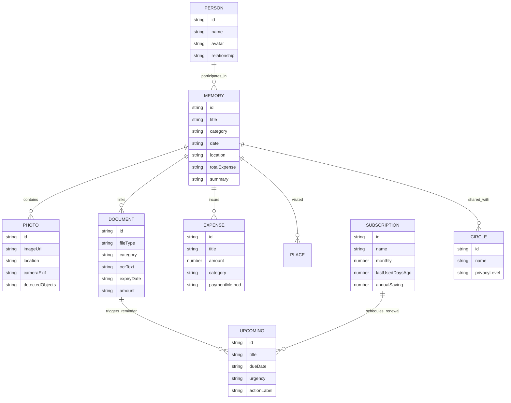

# LifeSphere — Master Product Specification & UX Architecture

> **"LifeSphere doesn't just store your digital fragments. It understands how every part of your life is connected."**

---

## 1. Executive Summary & Product Vision

### 1.1 The Core Problem
Modern personal digital life is fragmented across disconnected silos:
* **Photos** live in Google Photos / iCloud with zero context on expenses or booking receipts.
* **Documents & IDs** sit in WhatsApp folders, Google Drive, or local storage.
* **Bills & Invoices** are scattered across Gmail, SMS, and utility portals.
* **Expenses** are recorded in UPI transaction histories or personal finance trackers without emotional or episodic context.
* **Subscriptions** renew silently in the background with no utilization awareness.
* **Travel & Memories** are reduced to raw photo folders or social media posts without itinerary context.

### 1.2 The LifeSphere Solution
**LifeSphere is a Personal Life Operating System (Life OS)**. It is **not** a Google Photos clone, **not** an enterprise SaaS dashboard, and **not** an AI novelty chatbot.

It creates a **bi-directional personal knowledge graph** where:
$$\text{Memory} \longleftrightarrow \text{Photos} \longleftrightarrow \text{Documents} \longleftrightarrow \text{Expenses} \longleftrightarrow \text{Places} \longleftrightarrow \text{People} \longleftrightarrow \text{Reminders}$$

When a user visits a memory like **Goa Coastal Journey**, they see:
```text
Goa Coastal Journey (March 12–16, 2026)
├── 128 Photos (Sunset, Anjuna Cliffs, Seafood Dinner)
├── 2 Key Documents (IndiGo Flight #6E-2018 + Taj Exotica Hotel Voucher)
├── ₹18,400 Total Expenses (Hotel ₹8.2k, Dining ₹4.1k, Travel ₹3.8k, Activities ₹2.3k)
├── 5 Connected Locations (Baga Beach, Panjim, Anjuna, Brittos, Dabolim)
├── 3 People (Aman Gupta, Rhea Sen, Self)
└── Chronological Day-by-Day Journey Roadmap
```

---

## 2. Core Entity Graph & Data Model



---

## 3. Design System & Visual Grammar

### 3.1 Design Philosophy: *Premium Warm Digital Product*
* **Warm Neutral Editorial Palette**: Replaces harsh cyberpunk blacks, neon glows, and generic SaaS greys with an inviting, publication-grade warm paper aesthetic.
* **Intentional Typography**: High-contrast Serif headings for emotional milestone titles, paired with clean, highly legible Sans-serif for data, labels, EXIF metadata, and buttons.
* **Ergonomic Standards**: Minimum **44px × 44px** tap targets on touch devices, full safe-area-inset compliance, and native spring physics.

### 3.2 Color Tokens

| Token | Hex Code | Semantic Role |
| :--- | :--- | :--- |
| `bg-base` | `#F7F6F2` | Page canvas (warm off-white paper base) |
| `bg-surface` | `#FFFFFF` | Primary content cards and sheets |
| `bg-subtle` | `#F0EFEA` | Secondary containers, tag backgrounds, input fields |
| `text-primary` | `#17181C` | Deep ink primary text, titles, monetary values |
| `text-secondary` | `#6B6D73` | Subtitles, metadata, timestamps, camera EXIF |
| `text-tertiary` | `#9A9C9F` | Keyboard shortcuts, disabled labels, faint borders |
| `accent-indigo` | `#5B5CE2` | Primary interactive brand color, key buttons, story badges |
| `accent-lavender` | `#E8E7FF` | Soft tinted chips, memory highlights, selection backgrounds |
| `accent-amber` | `#E9A23B` | Document expiry alerts, proactive savings warnings |
| `accent-success` | `#3A9D78` | Resolved obligations, positive financial trends, pay actions |
| `accent-rose` | `#E98291` | Urgent bills due tomorrow, critical alerts |

---

## 4. Screen-by-Screen UX & Functional Architecture

```
┌─────────────────────────────────────────────────────────────┐
│                    LIFESPHERE APP SHELL                     │
├──────────────┬──────────────────────────────────────────────┤
│ SIDEBAR      │ MAIN CONTENT VIEWPORT                        │
│ ───────────  │ ───────────────────────────────────────────  │
│ [L] Brand    │ 1. Home / Daily Assistant (/dashboard)       │
│ [+] Add Item │ 2. Memories & Life Stream (/timeline)        │
│ ───────────  │ 3. Editorial Photo Archive (/photos)         │
│ • Home       │ 4. Intelligent Document Vault (/documents)   │
│ • Memories   │ 5. Unified Life Timeline (/upcoming)         │
│ • Photos     │ 6. Subscriptions Optimizer (/subscriptions)  │
│ • Documents  │ 7. Memory Knowledge Graph (/graph)           │
│ • Upcoming   │ 8. Life in Numbers Analytics (/analytics)    │
│ • Subs       │ 9. Contextual Orbit AI Chat (/chat)          │
│ • Insights   │ 10. Life Circles & Sharing (/circles)        │
│ • Map        │                                              │
│ ───────────  │                                              │
│ [Search ⌘K]  │                                              │
│ [Ask Orbit]  │                                              │
└──────────────┴──────────────────────────────────────────────┘
```

---

### Screen 1: Home / Personal Daily Assistant (`/dashboard`)
* **Purpose**: Your daily briefing engine. Answers *"What matters in my life today?"* within 5 seconds.
* **Components**:
  1. **Editorial Greeting**: Time-aware greeting (*"Good morning, Guntass."*) + date chip + quick document upload CTA.
  2. **Needs Your Attention**: Compact, left-bordered urgent action strips:
     * *Electricity Bill*: ₹4,230 · Due tomorrow → `[Pay now]` / `[Remind me]`
     * *Passport Renewal*: Expires in 18 days → `[View Doc]` / `[Remind in 2d]`
     * *Adobe CC*: Unused 45 days → `[Review renewal]`
  3. **Your Life, Lately**: Editorial card spotlighting the latest multi-entity chapter (*Goa Coastal Journey*) with live photo counter, total spent, and connected documents.
  4. **Coming Up**: Clean chronological schedule preview showing impending bills, flights, and events.
  5. **Orbit Life Briefing**: Human-written synthesis of the week's obligations and financial health.

---

### Screen 2: Memories & Life Timeline (`/timeline`)
* **Purpose**: A chronological life stream organized into rich chapters rather than flat lists.
* **Components**:
  1. **Zoom & Filters**: Switch between *Year*, *Month*, *Week*, *Day* with category filtering (*Travel*, *Health*, *Milestones*, *Celebrations*).
  2. **Featured Chapter Hero**: Full-bleed cinematic cover with gradient scrim, date, and location.
  3. **Milestone Stream**: Alternating timeline nodes with connected thumbnail arrays.
  4. **Interactive Memory Story View (Modal / Sheet)**:
     * **Roadmap**: Step-by-step itinerary (*Delhi → Dabolim Arrival → Taj Stay → Baga Beach → Anjuna Sunset → Return Flight*).
     * **128 Photos Grid**: Filterable capture gallery with one-click view.
     * **Expenses Breakdown**: Itemized list summing to exact total (*Hotel ₹8,200 · Food ₹4,100 · Travel ₹3,800 · Activities ₹2,300*).
     * **Connected Documents**: Scanned boarding passes, hotel confirmation vouchers.
     * **People & Places**: Linked avatar chips and geolocation tags.
     * **Orbit Query Trigger**: *"Ask Orbit about this memory"*.

---

### Screen 3: Editorial Photos Vault (`/photos`)
* **Purpose**: High-context visual capture archive where every photograph knows its story.
* **Components**:
  1. **Dynamic Category Tabs**: *All Captures*, *Trips*, *People*, *Places*, *Documents & Receipts*.
  2. **Editorial Masonry Gallery**: Variable-aspect image cards showing metadata overlays on hover.
  3. **Contextual Photo Viewer**:
     * Scalable photography canvas with smooth zoom.
     * **Part of Memory Pill**: Direct hyperlink to parent Memory Story (*"Part of: Goa Coastal Journey"*).
     * **People Present**: Tagged companion avatars.
     * **Location & Geotag**: Pinpoint location data.
     * **Linked Documents**: Receipts or tickets associated with the photograph's moment.
     * **Technical EXIF**: Camera model, lens, aperture, shutter speed, ISO.

---

### Screen 4: Intelligent Document Vault (`/documents`)
* **Purpose**: Personal records archive with automated OCR extraction and proactive scheduling.
* **Components**:
  1. **Proactive Extraction Cards**:
     * *Passport Card*: Automatic countdown (*18 days remaining*) with renewal guidance.
     * *Utility Invoice Card*: Amount payable, units consumed, and payment due date.
  2. **Smart Categories**: *Government ID*, *Financial & Bills*, *Travel Bookings*, *Appliance Warranties*, *Medical Records*.
  3. **3-Column Document Inspector**:
     * *Col 1 (Preview)*: High-fidelity document mock card with vendor badge.
     * *Col 2 (OCR Text)*: Extracted raw text block with one-click clipboard copy.
     * *Col 3 (Intelligence)*: Parsed expiry date, identified legal entities, and **[Set Reminder]** trigger that schedules an alert in the Upcoming timeline.

---

### Screen 5: Unified Life Timeline (`/upcoming`)
* **Purpose**: Single chronological spine merging bills, renewals, document deadlines, flights, and personal tasks.
* **Components**:
  1. **Timeline Spine**: Continuous vertical connector line with pulsing category dots.
  2. **Date Groups**: *TODAY*, *SEP 1*, *SEP 2*, *SEP 18*, *OCT 4*, *SNOOZED*.
  3. **Action Triggers**:
     * `[Pay now]` / `[Mark Done]`: Resolves task and updates Dashboard simultaneously.
     * `[Snooze 2d]`: Moves task into the snoozed group with updated time labels.

---

### Screen 6: Subscriptions Optimizer (`/subscriptions`)
* **Purpose**: Recurring cost monitoring and idle plan detection.
* **Components**:
  1. **Spending Barometer**: Live monthly total (e.g. *₹2,127/mo*) vs. annual recurring burden (e.g. *₹25,524/yr*).
  2. **Unused Plan Alert**: Amber card for services with zero detected usage over 30+ days (*"Adobe CC unused for 45 days. Cancel to save ₹15,588/year"*).
  3. **Active Plans List**: Service logo, plan tier, renewal date, last active days ago, and `[Cancel plan]` button with live recalculation.

---

### Screen 7: Memory Knowledge Graph (`/graph`)
* **Purpose**: An interactive visual constellation of your connected life.
* **Components**:
  1. **Soft Canvas Graph**: Clean warm-white background with fluid physics nodes (Trips, Documents, Expenses, Photos, Places, People).
  2. **Relationship Links**: Animated curved edges showing linkages (e.g. *Goa Trip → Flight Ticket → ₹3,800 Expense*).
  3. **Node Inspector Panel**: Spring-animated bottom sheet displaying entity details and direct navigation links.

---

### Screen 8: Contextual Orbit AI (`/chat` & Universal Overlay)
* **Purpose**: LifeSphere's connected natural language intelligence layer.
* **Components**:
  1. **Dual State Layout**:
     * *Empty State*: Centered editorial hero with suggested life queries (*"How much did I spend in Goa?"*, *"When does passport expire?"*).
     * *Active Conversation*: Clean bubble thread with user messages in brand indigo and Orbit responses in white card containers with embedded interactive Action Cards.
  2. **Real Graph Querying**: Reads live state from `useLifeDataStore` to answer with exact itemized numbers, dates, and actionable navigation buttons.

---

### Screen 9: Universal Search (`⌘K`)
* **Purpose**: Instant multi-entity global finder.
* **Components**:
  * Keyboard shortcut `⌘K` / `Ctrl+K`.
  * Instant search categorized across **Memories**, **Photos**, **Documents**, **Expenses**, **People**, and **Places**.
  * Direct action routing to open the exact inspector or story view.

---

### Screen 10: Life Circles (Family & Shared Life)
* **Purpose**: Privacy-controlled shared life hubs for family, group travel, and close friends.
* **Components**:
  1. **Circle Types**: *Family Circle*, *Goa Travel Circle*, *College Friends*.
  2. **Privacy Matrix**:
     * `Only Me`: Passports, personal medical files, salary slips.
     * `Circle Members`: Group trip photos, restaurant split receipts, flight tickets.
  3. **Multi-Contributor Stream**: Shared photo pool and collective trip expense pool.

---

## 5. Technical & State Architecture

### 5.1 Data Flow Pipeline
```text
┌────────────────────────────────────────────────────────┐
│                   USER INTERACTION                     │
│  (e.g., Click 'Pay Bill', 'Upload Doc', 'Add Expense') │
└──────────────────────────┬─────────────────────────────┘
                           │
                           ▼
┌────────────────────────────────────────────────────────┐
│               ZUSTAND GLOBAL LIFE STORE                │
│             (store/useLifeDataStore.ts)                │
│                                                        │
│  • documents[]       • memories[]      • expenses[]    │
│  • photos[]          • subscriptions[] • upcoming[]    │
└──────────────────────────┬─────────────────────────────┘
                           │
       ┌───────────────────┼───────────────────┐
       ▼                   ▼                   ▼
┌──────────────┐    ┌──────────────┐    ┌──────────────┐
│  DASHBOARD   │    │   UPCOMING   │    │   ORBIT AI   │
│  Alerts sync │    │Timeline sync │    │Answers update│
└──────────────┘    └──────────────┘    └──────────────┘
```

### 5.2 Core Mutation APIs
* `addPhoto(photo)`: Inserts photo, parses EXIF, links to `memoryId`.
* `addDocument(doc)`: Extracts OCR text, sets renewal date, pushes alert.
* `addExpense(expense, memoryId)`: Records transaction, recalculates memory `totalExpense`.
* `addMemory(memory)`: Creates new story node with journey roadmap.
* `markUpcomingDone(id)`: Removes alert across Dashboard and Upcoming timeline.
* `cancelSubscription(id)`: Removes recurring charge, reduces annual expenditure.

---

## 6. Hackathon Pitch & Demonstration Guide

### 6.1 The 30-Second Elevator Pitch
> *"Every day, our digital life gets scattered across Google Photos, WhatsApp, email bills, and banking apps. When you take a vacation, your photos are in one app, flight tickets in your inbox, hotel booking in WhatsApp, and expenses in UPI. **LifeSphere is a Personal Life Operating System that connects these scattered fragments into unified stories, and proactively acts on what needs your attention today.**"*

### 6.2 Judge Demo Script (3 Minutes)
1. **Minute 1: The Daily Assistant (Dashboard)**
   * Show the warm editorial greeting.
   * Point out **Needs Your Attention**: *"LifeSphere extracted that my BSES power bill of ₹4,230 is due tomorrow and my passport expires in 18 days."*
   * Click **"Pay"** → Show bill resolving instantly.
2. **Minute 2: The Connected Story (Goa Coastal Journey)**
   * Open the **Goa Story** from the timeline.
   * Highlight the convergence: *"Here is our complete life chapter — 128 photos, hotel invoice, IndiGo flight ticket, and exact ₹18,400 spending breakdown in one connected view."*
   * Click the `+` button, add a ₹1,500 cafe expense, and demonstrate the trip total updating live to ₹19,900.
3. **Minute 3: Natural Language Intelligence (Orbit AI)**
   * Open Orbit AI (`⌘K` or `/chat`).
   * Ask: *"How much did I spend in Goa?"* → Orbit outputs the itemized breakdown with a link to the story.
   * Ask: *"When does my passport expire?"* → Orbit returns the exact date (Sep 18, 2026) and remaining days.
   * Conclude: *"This is LifeSphere — your life, connected and understood."*

---

## 7. Verification & Production Checklist

- [x] **Zero Build Errors**: Clean compilation via `npm run build` (Turbopack / Next.js 16.2.12).
- [x] **TypeScript Strictness**: Zero type mismatches across all 11 routes and store interfaces.
- [x] **Mobile Ergonomics**: 44px+ tap targets, bottom dock navigation, safe-area-inset compliance.
- [x] **Connected State Reactivity**: Actions performed on any screen update all related views in real time.
- [x] **Aesthetic Integrity**: Restrained warm editorial palette (`#F7F6F2`), high-contrast typography, and subtle micro-animations.
